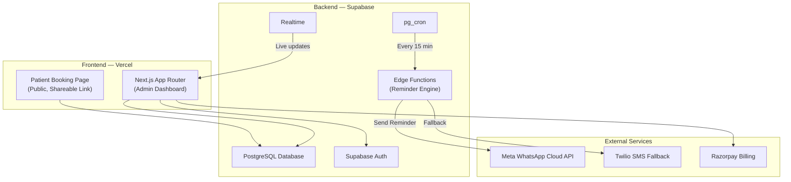
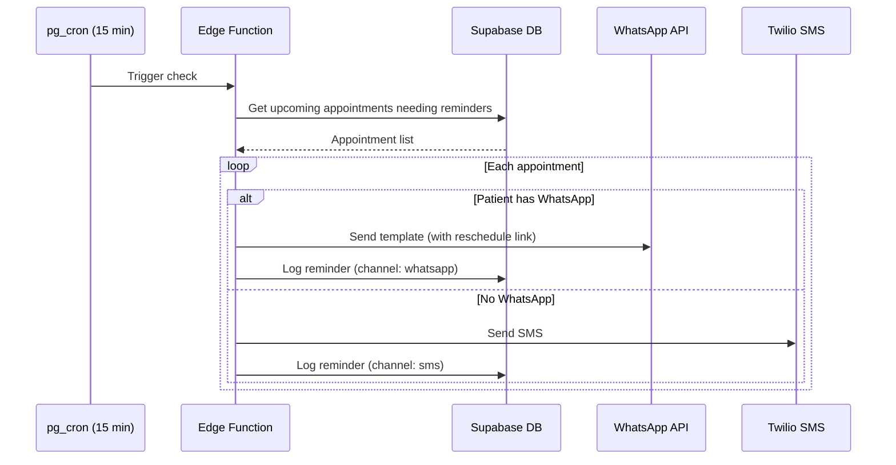

# ClinicPilot V1 — Final Implementation Plan

## Goal
Build and launch a real working V1 for clinics and close first paying customer within 30 days.

**Positioning:** *"We're not a clinic management system. We're a no-show killer."*

---

## 🚦 Current Status & Progress (Updated May 1, 2026)
- **Frontend MVP:** ✅ Deployed locally (`http://localhost:3001`)
- **Pitch-Ready UI:** ✅ Landing page, Dashboard, and Patient Booking flow completed.
- **Backend/DB:** ⏳ Pending connection to Supabase (Schema written, awaiting execution).
- **Integrations:** ⏳ Pending Meta/WhatsApp business verification.

---

## 1. Competitive Intelligence (13 Competitors Analyzed)

### Competitor Pricing & Feature Matrix

| # | Competitor | Price/mo | Appt Booking | Public Page | WhatsApp | SMS | 1-Click Resched | Multilingual | Staff Roles | Patient DB | No-Show Analytics | Dashboard | DFY Setup | Features | ₹/Feature |
|---|---|---|---|---|---|---|---|---|---|---|---|---|---|---|---|
| 1 | Practo Ray | ₹2,500 | ✅ | ✅ | ❌ | ✅ | ❌ | ❌ | ✅ | ✅ | ❌ | ✅ | ❌ | 6 | ₹417 |
| 2 | Eka.Care | ₹1,416 | ✅ | ✅ | ⚠️ | ❌ | ❌ | ✅ | ✅ | ✅ | ❌ | ✅ | ❌ | 6.5 | ₹218 |
| 3 | Lybrate Cube | ₹799 | ✅ | ✅ | ❌ | ❌ | ❌ | ❌ | ✅ | ✅ | ❌ | ✅ | ❌ | 5 | ₹160 |
| 4 | Lybrate Tab | ₹1,349 | ✅ | ✅ | ❌ | ❌ | ❌ | ❌ | ✅ | ✅ | ❌ | ✅ | ❌ | 5 | ₹270 |
| 5 | HealthPlix | ₹1,000 | ✅ | ✅ | ⚠️ | ✅ | ❌ | ✅ | ✅ | ✅ | ❌ | ✅ | ❌ | 7 | ₹143 |
| 6 | DocPulse | ₹3,000 | ✅ | ✅ | ❌ | ❌ | ❌ | ❌ | ✅ | ✅ | ❌ | ✅ | ❌ | 5 | ₹600 |
| 7 | Clinicea | ₹1,999 | ✅ | ✅ | ⚠️ | ❌ | ❌ | ❌ | ✅ | ✅ | ❌ | ✅ | ❌ | 5.5 | ₹364 |
| 8 | Clinicia | ₹583 | ✅ | ❌ | ✅ | ✅ | ❌ | ✅ | ✅ | ✅ | ❌ | ✅ | ❌ | 7 | ₹83 |
| 9 | Drlogy | ₹299 | ✅ | ✅ | ⚠️ | ✅ | ❌ | ❌ | ✅ | ✅ | ❌ | ✅ | ❌ | 6 | ₹50 |
| 10 | AiSensy | ₹1,500 | ❌ | ❌ | ✅ | ❌ | ❌ | ✅ | ❌ | ❌ | ❌ | ✅ | ❌ | 3 | ₹500 |
| 11 | Interakt | ₹999 | ❌ | ❌ | ✅ | ❌ | ❌ | ❌ | ❌ | ❌ | ❌ | ✅ | ❌ | 2 | ₹500 |
| 12 | Wati | ₹2,499 | ❌ | ❌ | ✅ | ❌ | ❌ | ✅ | ❌ | ❌ | ❌ | ✅ | ❌ | 3 | ₹833 |
| 13 | Appointy | ₹1,700 | ✅ | ✅ | ❌ | ✅ | ❌ | ❌ | ✅ | ✅ | ❌ | ✅ | ❌ | 6 | ₹283 |
| | **AVERAGE** | **₹1,511** | | | | | | | | | | | | **5.1** | **₹296** |
| | **🟢 ClinicPilot** | **₹749** | ✅ | ✅ | ✅ | ✅ | ✅ | ✅ | ✅ | ✅ | ✅ | ✅ | ✅ | **11** | **₹68** 🔥 |

### Key Findings
- **Avg competitor:** ₹1,511/mo for 5.1 features → **₹296/feature**
- **ClinicPilot:** ₹749/mo for 11 features → **₹68/feature** (best value in India)
- **3 EXCLUSIVE features nobody else has:** One-Click Reschedule, No-Show Analytics, Done-For-You Setup

---

## 2. Pricing Strategy — Exactly HALF of Competitor Average

| | 🟢 **Starter** | 🔵 **Growth** | 🟣 **Clinic Pro** |
|---|---|---|---|
| **Monthly** | **₹749/mo** | **₹1,249/mo** | **₹2,249/mo** |
| **Annual** | ₹7,499/yr (save 17%) | ₹12,499/yr (save 17%) | ₹22,499/yr (save 17%) |
| **vs Avg Competitor** | 50% cheaper than ₹1,511 | 50% cheaper than ₹2,500 | 50% cheaper than ₹4,500 |
| Doctors | 1 | Up to 5 | Up to 15 |
| Staff Seats | 2 | 10 | 30 |
| WhatsApp Reminders | 300/mo | Unlimited | Unlimited |
| SMS Fallback | 50/mo | 200/mo | 500/mo |
| One-Click Reschedule | ✅ | ✅ | ✅ |
| Public Booking Page | ✅ | ✅ | ✅ |
| Multilingual | Hindi + English | 5 languages | 5 languages |
| No-Show Analytics | Basic | Advanced | Advanced + Export |
| Priority Support | Email | WhatsApp | Dedicated manager |
| Custom Branding | ❌ | ✅ | ✅ |
| Done-For-You Setup | ✅ | ✅ | ✅ |

### ROI Pitch
```
🏥 Doctor: 30 patients/day × 20% no-show = 6 missed
💰 Lost: 6 × ₹500 = ₹3,000/day = ₹78,000/month
✅ ClinicPilot reduces no-shows 40% → saves ₹31,200/mo
📈 ROI: ₹749 cost → ₹31,200 saved = 4,166% return
```

---

## 3. User Review Required

> [!IMPORTANT]
> **Answers needed before we build:**
> 1. **Product name** — "ClinicPilot" OK?
> 2. **Supabase account** — Do you have one? (Free tier is enough)
> 3. **Vercel account** — Do you have one? (Free tier)
> 4. **Razorpay account** — For subscription payments
> 5. **Domain name** — Own one, or use Vercel subdomain?
> 6. **Business registration** — GST/Udyam for WhatsApp API?
> 7. **Dedicated phone number** — Not linked to personal WhatsApp?
> 8. **First pilot clinic** — Know any doctor/clinic in Bhopal to test with?

---

## 4. Architecture



## 5. Tech Stack (Locked)

| Layer | Technology | Cost | Why |
|---|---|---|---|
| Frontend | Next.js 15 (App Router) + Vanilla CSS | Free | SSR, SEO, your expertise |
| UI | shadcn/ui + Radix | Free | Premium, accessible |
| Backend/DB | Supabase (Postgres + Auth + Edge Functions) | Free tier | All-in-one |
| WhatsApp | Meta Cloud API (Direct) | ₹0.145/msg | No BSP fee |
| SMS | Twilio | ~₹7/SMS | Fast setup, no DLT |
| Payments | Razorpay Subscriptions | 2%/txn | UPI AutoPay |
| Hosting | Vercel | Free tier | Zero-config |
| Scheduling | pg_cron + pg_net | Free | DB-level cron |
| Email | Resend | Free (3K/mo) | Transactional |

**V1 running cost: ₹0/mo** (pay-per-use on messages only)

---

## 6. Database Schema

```sql
-- Multi-tenant with RLS on every table

CREATE TABLE clinics (
    id UUID PRIMARY KEY DEFAULT gen_random_uuid(),
    name TEXT NOT NULL,
    slug TEXT UNIQUE NOT NULL,
    phone TEXT, email TEXT, address TEXT,
    timezone TEXT DEFAULT 'Asia/Kolkata',
    default_language TEXT DEFAULT 'en',
    whatsapp_phone_id TEXT,
    subscription_plan TEXT DEFAULT 'trial', -- trial/starter/growth/clinic_pro
    subscription_status TEXT DEFAULT 'active',
    razorpay_subscription_id TEXT,
    trial_ends_at TIMESTAMPTZ DEFAULT NOW() + INTERVAL '14 days',
    created_at TIMESTAMPTZ DEFAULT NOW()
);

CREATE TABLE staff (
    id UUID PRIMARY KEY DEFAULT gen_random_uuid(),
    clinic_id UUID REFERENCES clinics(id) ON DELETE CASCADE,
    user_id UUID REFERENCES auth.users(id),
    name TEXT NOT NULL,
    role TEXT NOT NULL CHECK (role IN ('owner','doctor','receptionist')),
    phone TEXT, is_active BOOLEAN DEFAULT true,
    created_at TIMESTAMPTZ DEFAULT NOW()
);

CREATE TABLE doctors (
    id UUID PRIMARY KEY DEFAULT gen_random_uuid(),
    clinic_id UUID REFERENCES clinics(id) ON DELETE CASCADE,
    staff_id UUID REFERENCES staff(id),
    name TEXT NOT NULL, specialization TEXT,
    consultation_duration_min INT DEFAULT 15,
    created_at TIMESTAMPTZ DEFAULT NOW()
);

CREATE TABLE working_hours (
    id UUID PRIMARY KEY DEFAULT gen_random_uuid(),
    doctor_id UUID REFERENCES doctors(id) ON DELETE CASCADE,
    day_of_week INT NOT NULL CHECK (day_of_week BETWEEN 0 AND 6),
    start_time TIME NOT NULL, end_time TIME NOT NULL,
    is_available BOOLEAN DEFAULT true
);

CREATE TABLE patients (
    id UUID PRIMARY KEY DEFAULT gen_random_uuid(),
    clinic_id UUID REFERENCES clinics(id) ON DELETE CASCADE,
    name TEXT NOT NULL, phone TEXT NOT NULL, email TEXT,
    preferred_language TEXT DEFAULT 'en',
    has_whatsapp BOOLEAN DEFAULT true,
    created_at TIMESTAMPTZ DEFAULT NOW(),
    UNIQUE(clinic_id, phone)
);

CREATE TABLE appointments (
    id UUID PRIMARY KEY DEFAULT gen_random_uuid(),
    clinic_id UUID REFERENCES clinics(id) ON DELETE CASCADE,
    doctor_id UUID REFERENCES doctors(id),
    patient_id UUID REFERENCES patients(id),
    starts_at TIMESTAMPTZ NOT NULL, ends_at TIMESTAMPTZ NOT NULL,
    status TEXT DEFAULT 'confirmed'
        CHECK (status IN ('confirmed','cancelled','completed','no_show','rescheduled')),
    reschedule_token TEXT UNIQUE,
    notes TEXT, created_at TIMESTAMPTZ DEFAULT NOW()
);

CREATE TABLE reminders (
    id UUID PRIMARY KEY DEFAULT gen_random_uuid(),
    appointment_id UUID REFERENCES appointments(id) ON DELETE CASCADE,
    channel TEXT NOT NULL CHECK (channel IN ('whatsapp','sms','email')),
    type TEXT NOT NULL CHECK (type IN ('24h_before','2h_before','confirmation','reschedule')),
    status TEXT DEFAULT 'pending'
        CHECK (status IN ('pending','sent','delivered','read','failed')),
    sent_at TIMESTAMPTZ, meta_message_id TEXT, error_message TEXT,
    created_at TIMESTAMPTZ DEFAULT NOW()
);

CREATE TABLE message_templates (
    id UUID PRIMARY KEY DEFAULT gen_random_uuid(),
    clinic_id UUID REFERENCES clinics(id) ON DELETE CASCADE,
    type TEXT NOT NULL, language TEXT NOT NULL DEFAULT 'en',
    template_name TEXT NOT NULL, body TEXT NOT NULL,
    is_approved BOOLEAN DEFAULT false,
    created_at TIMESTAMPTZ DEFAULT NOW(),
    UNIQUE(clinic_id, type, language)
);

-- Indexes
CREATE INDEX idx_appointments_starts_at ON appointments(starts_at);
CREATE INDEX idx_appointments_clinic_status ON appointments(clinic_id, status);
CREATE INDEX idx_reminders_status ON reminders(status, type);
CREATE INDEX idx_patients_clinic_phone ON patients(clinic_id, phone);
```

---

## 7. Feature Breakdown

### Phase 1: Core Engine (Week 1–2)
- **Auth & Multi-tenancy:** Supabase Auth, clinic registration, staff invite, RLS policies
- **Appointment Booking:** Admin calendar (week/day), public page at `/book/{slug}`, mobile-first
- **Doctor Schedule:** Working hours CRUD, block dates, consultation duration

### Phase 2: Reminder Engine (Week 2–3)
- **WhatsApp Reminders:** Confirmation + 24h + 2h reminders, all with reschedule link
- **One-Click Reschedule:** Unique token link → pick new slot → auto-confirmed
- **SMS Fallback:** Twilio when WhatsApp unavailable, status tracking

### Phase 3: Dashboard & Polish (Week 3–4)
- **Dashboard:** Today's appointments, no-show rate, reminder delivery stats
- **Patient Management:** CRUD, search, visit history, language preference
- **Staff Roles:** Owner (full) / Doctor (own schedule) / Receptionist (booking)
- **Settings:** Clinic profile, reminder timing, templates, working hours
- **Analytics:** No-show rates (7/30 day), reminder performance charts

### Phase 4: Monetization (Week 4)
- **Subscriptions:** 14-day trial → Starter ₹749 / Growth ₹1,249 / Clinic Pro ₹2,249
- **Razorpay:** UPI AutoPay, dunning, usage enforcement

---

## 8. Reminder Engine Flow



---

## 9. File Structure

```
clinicpilot/
├── .env.local
├── next.config.js
├── package.json
├── middleware.ts
├── src/
│   ├── app/
│   │   ├── layout.js, page.js, globals.css
│   │   ├── (auth)/login/page.js, register/page.js
│   │   ├── (dashboard)/
│   │   │   ├── layout.js, page.js
│   │   │   ├── appointments/page.js
│   │   │   ├── patients/page.js
│   │   │   ├── staff/page.js
│   │   │   ├── analytics/page.js
│   │   │   └── settings/page.js
│   │   ├── book/[slug]/page.js
│   │   ├── reschedule/[token]/page.js
│   │   └── api/webhooks/{whatsapp,razorpay,twilio}/route.js
│   ├── components/{ui,dashboard,calendar,booking}/
│   ├── lib/{supabase/,whatsapp.js,twilio.js,razorpay.js,reminders.js,i18n.js,utils.js}
│   └── hooks/{useAuth,useClinic,useAppointments}.js
└── supabase/migrations/001_initial_schema.sql
```

---

## 10. 30-Day Sprint Plan

### Week 1 — Foundation
| Day | Task (3-4 hrs) | Deliverable |
|---|---|---|
| 1 | Next.js + Supabase + shadcn/ui setup | ✅ Running locally on port 3001 |
| 2 | DB schema + RLS + seed data | ⏳ Tables + policies designed, pending DB connection |
| 3 | Auth (register/login/logout) | ⏳ Protected routes pending Supabase Auth |
| 4 | Clinic onboarding + slug | ⏳ Pending Auth |
| 5 | Doctor schedule management UI | ⏳ Pending backend |
| 6 | Appointment booking & Dashboard (admin) | ✅ High-fidelity dashboard UI built |
| 7 | Public booking page `/book/{slug}` | ✅ Shareable link & booking flow built |

### Week 2 — Reminder Engine
| Day | Task (3-4 hrs) | Deliverable |
|---|---|---|
| 8 | Meta WhatsApp Cloud API setup | Test message sent |
| 9 | Message templates + Meta approval | Templates submitted |
| 10 | Reminder Edge Function (24h+2h) | Cron triggers reminders |
| 11 | One-click reschedule page | `/reschedule/{token}` works |
| 12 | Twilio SMS fallback | SMS when no WhatsApp |
| 13 | Webhook handlers (delivery status) | Tracking in DB |
| 14 | End-to-end test | Book → remind → reschedule ✅ |

### Week 3 — Dashboard & Polish
| Day | Task (3-4 hrs) | Deliverable |
|---|---|---|
| 15 | Dashboard home (stats, today) | Live dashboard |
| 16 | Patient management | CRUD + search |
| 17 | Staff + role-based access | 3 roles working |
| 18 | Analytics (no-show, reminders) | Charts |
| 19 | Settings page | Configurable |
| 20 | UI polish + responsive + dark mode | Premium feel |
| 21 | Landing page + pricing | Marketing homepage |

### Week 4 — Launch & First Customer
| Day | Task (3-4 hrs) | Deliverable |
|---|---|---|
| 22 | Razorpay subscription integration | Payments working |
| 23 | Usage tracking + plan enforcement | Trial countdown |
| 24 | Deploy to Vercel + domain | Live on internet |
| 25 | Security audit | Hardened |
| 26 | Onboarding script | 1-hour setup doc |
| 27 | Reach out to 10 clinics | Demos scheduled |
| 28 | Demo + free trial for 3 clinics | Trials active |
| 29 | Support & iterate | Bugs fixed |
| 30 | **Close first paying customer** 🎯 | **₹749/mo MRR** |

---

## 11. Financial Model

### Your Costs (at 5 clinics, ~500 patients)
| Item | Cost |
|---|---|
| Supabase, Vercel, Resend | ₹0 (free tiers) |
| WhatsApp (~3,000 msgs × ₹0.145) | ₹435 |
| Twilio SMS (~200 msgs × ₹7) | ₹1,400 |
| Domain | ₹100 |
| **Total** | **₹1,935/mo** |

### Your Revenue (at 5 clinics)
| Plan | Clinics | Revenue |
|---|---|---|
| Starter ₹749 | 2 | ₹1,498 |
| Growth ₹1,249 | 2 | ₹2,498 |
| Clinic Pro ₹2,249 | 1 | ₹2,249 |
| **Total** | **5** | **₹6,245/mo** |

**Gross Margin: 69%** · Break-even: 2 Starter clients

---

## 12. Sales Strategy

### Done-For-You Onboarding
1. Walk into 10 clinics in Bhopal with printed flyer
2. Pitch: *"Your patients forget appointments. I'll set up WhatsApp reminders in 1 hour. Free for 14 days."*
3. Setup on the spot — create clinic, add doctors, set schedule
4. Send test reminder to doctor's own phone
5. After 14 days: *"You saved X no-shows = ₹Y recovered. Keep it for ₹749/month. Practo charges ₹2,500 and can't even do this."*

### Targets: Dental, dermatology, eye clinics, GPs near you

---

## 13. Risk Mitigation

| Risk | Mitigation |
|---|---|
| WhatsApp template rejection | Submit simple templates Day 8. Approval: 24-48h. |
| Meta Business verification delay | Start Day 1. Have GST ready. |
| Low adoption | First month free for first 5 clinics. |
| SMS costs high | Push WhatsApp opt-in. SMS is fallback only. |
| Supabase limits | 500K Edge invocations/mo = plenty for V1. |

---

## 14. Verification Plan

### Automated
- `npm run build` — zero errors
- `supabase db reset` — migrations apply clean
- RLS test — Clinic A can't see Clinic B data

### Manual
- [ ] Real WhatsApp reminder to my phone
- [ ] SMS fallback to non-WhatsApp number
- [ ] One-click reschedule on mobile
- [ ] Real-time dashboard update on new booking
- [ ] Razorpay payment completes
- [ ] Role isolation (doctor vs receptionist vs owner)
